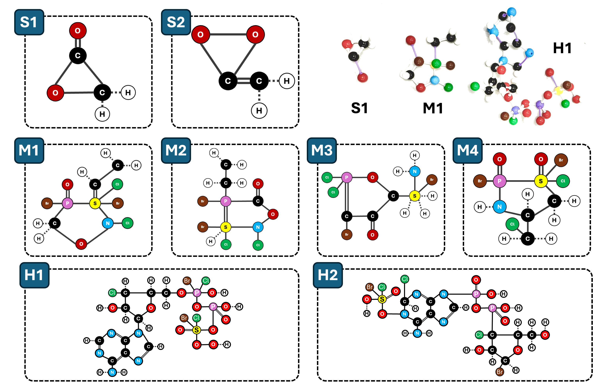
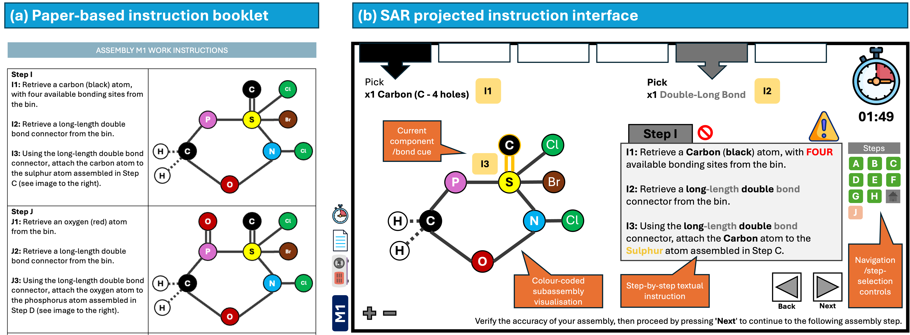

# Spatial Augmented Reality in Manual Assembly

This repository contains the source datasets, participant feedback materials, and supplementary figures for the study: **"Spatial Augmented Reality in Manual Assembly: An Empirical Investigation of Its Effects on Assembly Performance and Cognitive Ergonomics"**.

## About the Research

This study evaluates the effectiveness of an interactive, gesture-controlled Spatial Augmented Reality (SAR) system prototype compared to traditional paper-based work instructions. The evaluation was conducted through manual molecular assembly tasks of varying complexities (simple, medium, and hard) under both timed and untimed conditions.

### Key Highlights & Methodology
* **Participants:** Within-subjects study design with 16 participants ($N=16$).
* **SAR System Features:** Powered by Python and Google's MediaPipe framework for real-time hand-tracking and gesture control, alongside multi-modal projection-based "pick-by-light" guidance.
* **Cognitive Load Measurement:** Perceived workload was evaluated using the NASA-TLX framework, while objective cognitive load was monitored in real-time via frontal EEG alpha-band power using a Muse 2 headband.

### Empirical Performance Improvements with SAR (Untimed Conditions)

| Metric | Improvement with SAR vs. Paper | Statistical Significance |
| :--- | :--- | :--- |
| **Task Completion Time** | **-14.3%** (Median reduction) | $W = 573.0, p = .0018$ (Significant) |
| **Assembly Errors** | **-33.0%** (Reduction in errors) | $W = 106.5, p = .028$ (Significant) |
| **Component Picking Errors** | **-30.9%** (Reduction in errors) | $W = 313.5, p = .0047$ (Significant) |
| **Subjective Effort (NASA-TLX)** | Significant reduction | $p = .0006$ (Significant) |
| **Subjective Frustration (NASA-TLX)** | Significant reduction | $p = .020$ (Significant) |

---

## System Overview & Experimental Visuals

### 1. The Proposed SAR System

*The proposed SAR system: The left image illustrates the components of the system. The top-right image showcases the Python MediaPipe framework utilised for tracking the operator's hand movements, while the bottom-right image depicts textual and animated work instructions alongside the pick-by-light system. (Participant shown with informed consent.)*

The interactive Spatial Augmented Reality (SAR) prototype is built on an ergonomic workspace consisting of an assembly platform and a storage rack housing 12 component bins. The hardware configuration features an overhead-mounted low-blue-light projector and an Intel RealSense 3D depth camera:
* **Pick-by-Light & Visual Cues:** The projector dynamically highlights targeted containers with blinking light projections (simulating an industrial pick-by-light system) and overlays step-by-step textual instructions and animations directly on the physical work surface.
* **Real-time Hand Tracking:** Utilizing Google’s MediaPipe framework, the system tracks the operator's right index fingertip coordinates. A Cartesian coordinate framework maps regions of interest (ROIs) on the workspace to function as virtual buttons (e.g., Next, Previous, Home) which are activated via double-tap gesture control with a 1.5-second cooldown.

---

### 2. Molecular Assembly Complexity

*Schematic representation of the molecular assemblies utilised in the experiments. Double lines indicate long-length double bond connectors, solid single lines represent medium-length single bond connectors, and dashed lines denote short-length single bond connectors. Atoms are depicted using both colours and chemical symbols (e.g., oxygen is represented as red with the symbol "O").*

Eight distinct molecular model assemblies were designed to systematically evaluate how task difficulty interacts with instruction modalities:
* **Simple (S1, S2):** Built with 6 atoms (3 unique atom types) and 6 bonds (1 long double, 3 medium single, and 2 short single connectors).
* **Medium (M1–M4):** Built with 17 atoms (9 unique atom types) and 17 bonds (2 long double, 10 medium single, and 5 short single connectors).
* **Hard (H1, H2):** Built with 48 atoms (9 unique atom types) and 48–49 bonds (5–6 long double, 29 medium single, and 14 short single connectors).

To ensure consistency in cognitive and physical demands across each complexity level, the number of atoms and bond connectors remains identical for tasks within the same category. Atoms are represented by color-coded spheres engraved with chemical symbols, and bonds are represented by double bond (long), solid single bond (medium), and dashed single bond (short) physical connectors.

---

### 3. Comparison of Instruction Modalities

*Comparison of the paper-based instruction booklet and SAR projected instruction interface used during the molecular assembly task.*

The empirical study evaluated two distinct instruction methods during the molecular assembly tasks:
* **Paper-Based Booklet:** Static physical booklets containing sequential text descriptions and component diagrams. This interface provides no spatial tracking or bin references, requiring participants to manually search for and pick components, which elevates visual search times and errors.
* **SAR Projected Interface:** A dynamic, projection-mapped GUI overlaying visual instructions directly in-situ. By projecting pick-by-light highlights directly on the active bins and presenting dynamic animations of the assembly steps on the workspace, the system minimizes visual scanning, speeds up retrieval, and mitigates cognitive load.

---

## Repository Contents

* **[Dataset_SAR.csv](Dataset_SAR.csv)**: Raw experimental logs and metrics recorded during the user study sessions.
* **[FeedbackForm.pdf](FeedbackForm.pdf)**: Blank copy of the post-experiment participant survey used to collect feedback on user experience.
* **[Post-Experiment Survey.xlsx](Post-Experiment%20Survey.xlsx)**: Complete, anonymized responses of the participant feedback questionnaire along with calculated NASA-TLX scores.
